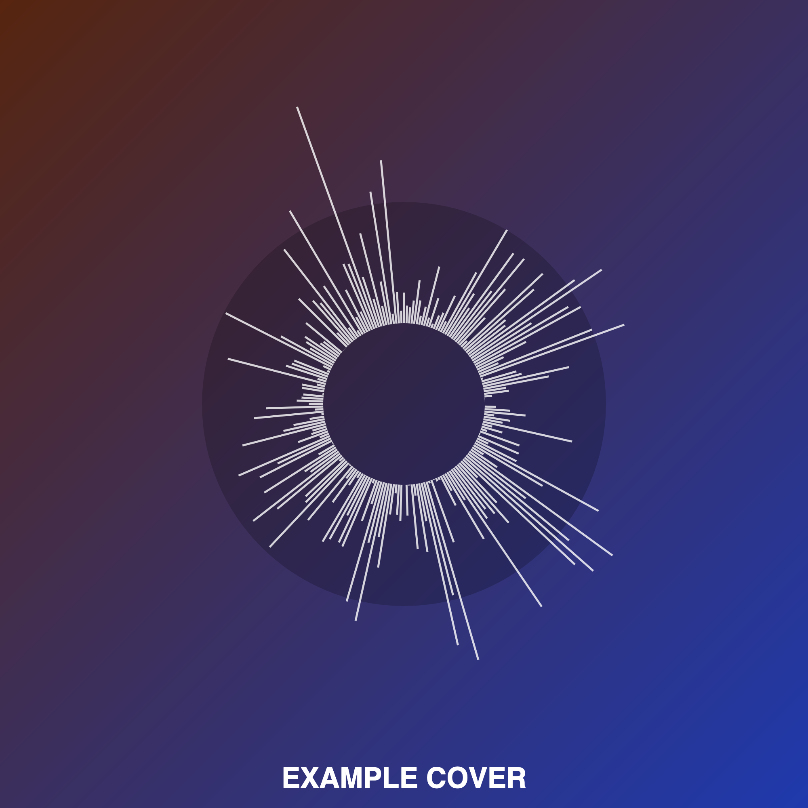

# 🎨 Audio Cover Art Generator

A lightweight web app that generates stylized radial cover art from audio files. Upload your music, customize the theme, and download high-resolution artwork — all directly in the browser.



---

## 🚀 Features

- 🎧 Upload `.mp3`, `.wav`, `.ogg`, or `.opus` files
- 🌗 Toggle between light and dark themes
- 🖋️ Add a custom album name to the cover
- 🖼️ Generate unique radial waveform art
- 💾 Download as high-resolution `.png`

---

## 🖥️ Live Demo

👉 [View on GitHub Pages](https://abhinerd.github.io/Cover-Art-Generator/)

---

## 📂 Project Structure

```
audio-cover-art-generator/
├── index.html              # Main HTML file
├── css/
│   └── style.css           # Styles
├── js/
│   └── main.js             # Application logic
├── assets/                 # Images, example covers, logos, etc.
│   └── example-cover.png   # Example output cover image
├── README.md
└── .gitignore
```
---

## ⚙️ How to Run Locally

1. Clone the repository:

   ```bash
   git clone https://github.com/yourusername/audio-cover-art-generator.git
   cd audio-cover-art-generator
   ```

2. Open `index.html` in a browser  
   *(or use Live Server in VSCode for auto reloads)*

---

## 📦 Deploying to GitHub Pages

1. Push your project to GitHub.
2. Go to `Settings > Pages` in your repository.
3. Under **Source**, select the `main` branch and `/ (root)` folder.
4. Save and wait a few moments for your site to go live at:

   ```
   https://<your_username>.github.io/audio-cover-art-generator/
   ```

---

## 🛠 Built With

- HTML5 + CSS3
- Vanilla JavaScript
- Web Audio API
- Canvas API

---
